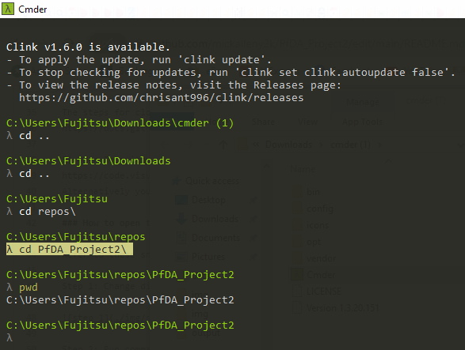
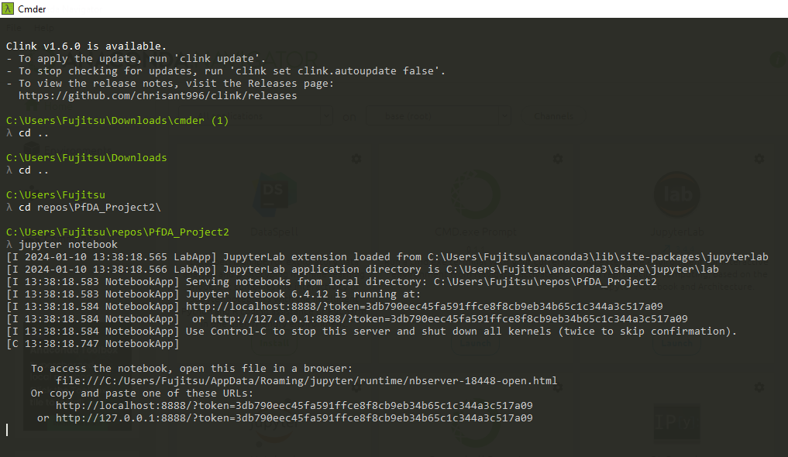
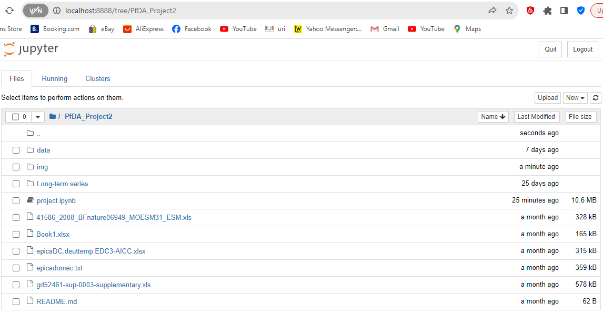

# Programming for Data Analysis : Project 2

An analysis of paleo-present climate data
• Analyse CO2 vs Temperature Anomaly from 800kyrs – present.
• Examine one other (paleo/modern) features (e.g. CH4 or polar ice-coverage)
• Examine Irish context:
• Fuse and analyse data from various data sources and format fused data set as a pandas
dataframe and export to csv and json formats
• For all of the above variables, analyse the data, the trends and the relationships between
them (temporal leads/lags/frequency analysis).
• Predict global temperature anomaly over next few decades (synthesise data) and compare to
published climate models if atmospheric CO2 trends continue
• Comment on accelerated warming based on very latest features (e.g. temperature/polar-icecoverage)

## INTRODUCTION
The European Project for Ice Coring in Antarctica (EPICA) is a multinational European project for deep ice core drilling in Antarctica. Its main objective is to obtain full documentation of the climatic and atmospheric record archived in Antarctic ice by drilling and analyzing ice cores. Evaluation of these records provides information about the natural climate variability and mechanisms of rapid climatic changes during the last glacial epoch going back 800,000 years.

## PURPOSE
- Analyse CO2 vs Temperature Anomaly from 800kyrs – present.
- Examine one other (paleo/modern) features (e.g. CH4 or polar ice-coverage)
- Examine Irish context.
- Fuse and analyse data from various data sources and format fused data set as a pandas
dataframe and export to csv and json formats
- For all of the above variables, analyse the data, the trends and the relationships between
them (temporal leads/lags/frequency analysis).
- Predict global temperature anomaly over next few decades (synthesise data) and compare to
published climate models if atmospheric CO2 trends continue
- Comment on accelerated warming based on very latest features (e.g. temperature/polar-icecoverage)

## CONTENTS
It contains a Jupyter notebook project.ipynb for my analysis and I tracked my progress using GitHub.
I used an academic referencing style.

## INSTRUCTIONS
### How to clone and run notebook
1. Download and Install Anaconda. Here's the link:
https://www.anaconda.com/download/

2) Download and Install Visual Studio Code. Here's the link:
https://code.visualstudio.com/

3) Clone Repository as follows:
- On GitHub.com, navigate to the main page of the repository.
  
- Above the list of files, click Code.
  

- Copy the URL for the repository.
  
  
- Open Git Bash.
  
- Change the current working directory to the location where you want the cloned directory.
  
- Type git clone, and then paste the URL you copied earlier.
  
- Press Enter to create your local clone.
  
The steps for cloning a repository are detailed in the link below:
https://docs.github.com/en/repositories/creating-and-managing-repositories/cloning-a-repository

5) Open Repository in Visual Studio Code
https://code.visualstudio.com/docs/sourcecontrol/intro-to-git#_open-a-git-repository
Alternatively you can open the repository in a Jupyter notebook.

### How to open the repository in a Jupyter notebook

Refer to these snapshots for a step-by-step guide:

Step 1: In Visual studio Code terminal or Cmder, change directory to PfDA_Project2 directory.

Step 2: Run command jupyter notebook

Step 3: The notebook opens in a web browser. It contains project.ipynb

## ISSUES
### Troubleshooting cloning errors

https://docs.github.com/en/repositories/creating-and-managing-repositories/troubleshooting-cloning-errors

If you're having trouble cloning a repository, check these common errors.
1. HTTPS cloning errors
 - Check your Git version
 - Ensure the remote is correct
 - Provide an access token
 - Check your permissions
 - Use SSH instead
 
 2. Error: Repository not found
  - Check your spelling
  - Checking your permissions
  - Check your SSH access
  - Check that the repository really exists
  
 3. Error: Remote HEAD refers to nonexistent ref, unable to checkout
